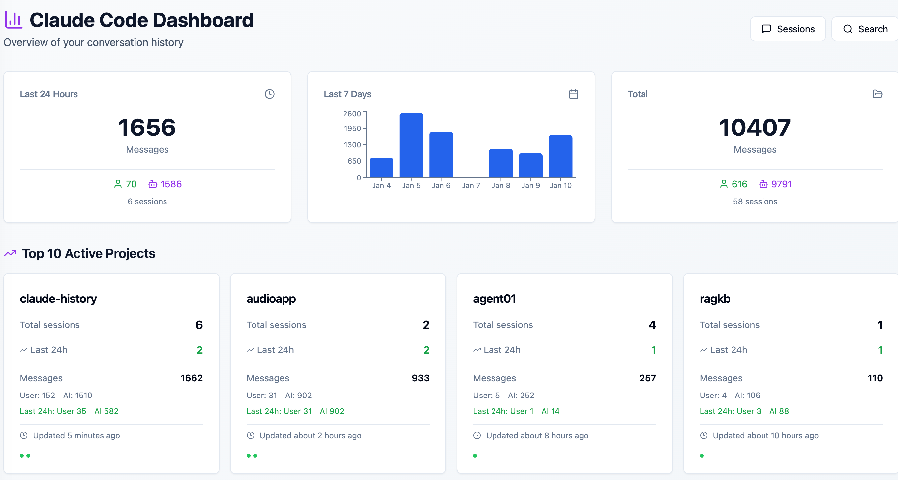
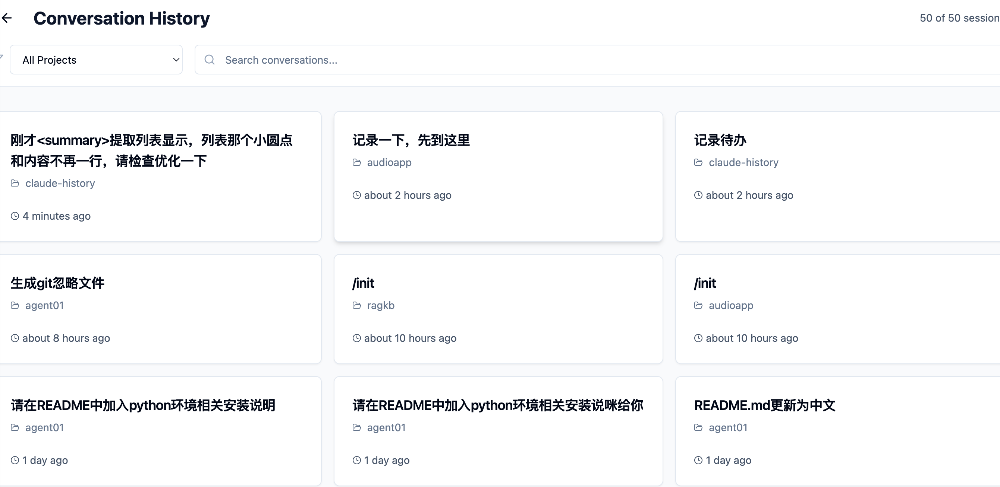
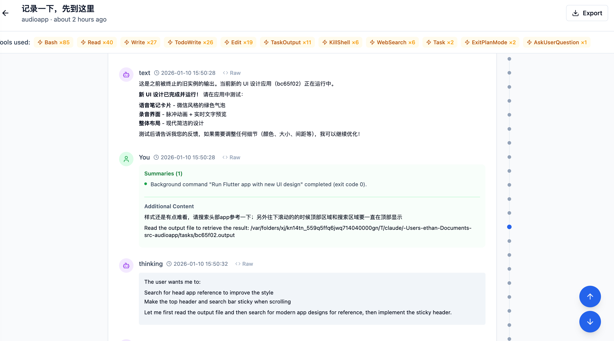
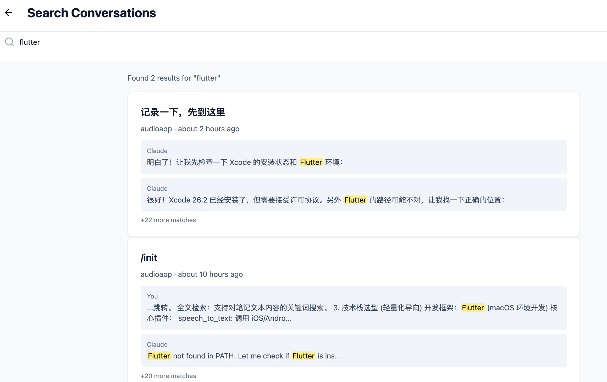

# Claude Code History Viewer

> 一个用于查看、搜索和分析 Claude Code 对话历史的 Web 应用，帮助开发者回顾开发过程、总结复盘、了解项目数据。

## ✨ 为什么需要这个工具？

使用 Claude Code 进行开发时，会产生大量有价值的对话数据。这个工具帮助你：

- **📚 回顾开发过程** - 快速浏览完整对话历史，回顾问题解决思路
- **📊 总结复盘** - 查看项目统计数据，了解开发节奏和模式
- **🔍 知识检索** - 全文搜索历史对话，找到之前解决过的问题
- **📈 数据洞察** - 了解与 AI 的协作情况，分析项目活跃度
- **💾 知识沉淀** - 导出重要对话，形成项目文档

## 🎯 功能特性

### 🌍 中英文切换

- 支持简体中文和英文两种语言
- 自动检测浏览器语言首次访问
- 记住用户语言偏好

### 📊 数据仪表盘



- 查看最近 24 小时、7 天和总计的对话统计数据
- 了解用户消息与 AI 回复的比例
- 按项目查看活跃度排名

### 📋 会话列表



- 浏览所有对话历史，按时间和项目筛选
- 快速预览会话信息、文件大小和消息数量
- 支持批量选择和删除会话
- 一键导出会话数据

### 💬 会话详情



- 查看完整对话内容，包括用户消息、AI 回复和工具调用
- 使用虚拟滚动技术，流畅处理长对话（数百条消息）
- 快速导航到消息位置
- 查看原始消息或渲染后的内容
- 支持 Markdown 语法高亮

### 🔍 全文搜索



- 搜索所有对话中的关键词
- 实时显示搜索结果
- 高亮匹配内容

### 📤 导出功能

- 导出为 Markdown 格式
- 导出为 JSON 格式
- 导出为 HTML 格式

### 📱 响应式设计

- 支持桌面和移动设备
- 深色模式支持

## 🛠️ 技术栈

- **Next.js 14** - React 框架
- **TypeScript** - 类型安全
- **Tailwind CSS** - 样式
- **shadcn/ui** - UI 组件库
- **date-fns** - 日期格式化
- **Lucide React** - 图标库
- **Recharts** - 数据可视化
- **@tanstack/react-virtual** - 虚拟滚动

## 📦 安装

```bash
# 克隆项目
git clone https://github.com/gptmaas/claude-history-viewer.git
cd claude-history-viewer

# 安装依赖
npm install
```

## 🚀 运行

```bash
# 开发模式
npm run dev

# 生产构建
npm run build
npm start
```

应用将在 [http://localhost:3000](http://localhost:3000) 启动。

## ⚙️ 配置

应用默认读取 `~/.claude` 目录下的对话历史。如需修改，设置环境变量：

```bash
export CLAUDE_DIR=/path/to/your/.claude
```

或在 `.env.local` 文件中配置：

```bash
CLAUDE_DIR=/path/to/your/.claude
```

## 📁 项目结构

```
claude-history-viewer/
├── app/
│   ├── api/                    # API 路由
│   │   ├── sessions/           # 会话列表和详情 API
│   │   ├── search/             # 搜索 API
│   │   └── stats/              # 统计数据 API
│   ├── sessions/               # 会话页面
│   │   ├── page.tsx            # 会话列表
│   │   └── [id]/page.tsx       # 会话详情
│   ├── search/page.tsx         # 搜索页面
│   ├── page.tsx                # 首页仪表盘
│   ├── layout.tsx              # 根布局
│   ├── providers.tsx            # 客户端 Providers
│   └── globals.css             # 全局样式
├── components/
│   ├── ui/                     # shadcn/ui 组件
│   ├── language-switcher.tsx    # 语言切换组件
│   ├── markdown-renderer.tsx   # Markdown 渲染器
│   ├── json-viewer.tsx         # JSON 查看器
│   ├── tool-viewer.tsx         # 工具调用查看器
│   └── user-message-renderer.tsx  # 用户消息渲染器
├── lib/
│   ├── claude-history.ts       # Claude 历史数据解析
│   ├── i18n.tsx              # 国际化上下文
│   ├── translations.ts         # 翻译词条
│   ├── xml-utils.ts            # XML 解析工具
│   ├── types.ts                # 类型定义
│   └── utils.ts                # 工具函数
├── docs/
│   └── static/                 # 文档图片
│       ├── dashboard.png
│       ├── session-list.png
│       └── session-detail.png
├── package.json
└── updateLog.md               # 更新日志
```

## 🎨 使用场景

### 开发复盘

定期查看项目统计数据，了解：
- 本周完成了哪些任务
- 与 AI 协作的频率
- 项目活跃度趋势

### 问题解决

遇到类似问题时，搜索历史对话：
- 快速找到之前的解决方案
- 了解问题的上下文
- 复用成功的解决思路

### 知识管理

导出重要的对话内容：
- 形成项目文档
- 记录最佳实践
- 分享团队知识

## 🚧 后续扩展

- [ ] 支持其他AI Coding工具如Trae、CodeX等
- [ ] 支持多用户和团队共享
- [ ] 添加标签和收藏功能
- [ ] 实时监控新对话
- [ ] 部署到 Vercel/自托管服务器
- [ ] 支持自定义数据源

## 📝 更新日志

详见 [updateLog.md](updateLog.md)

## 📄 许可证

MIT License

## 🤝 贡献

欢迎提交 Issue 和 Pull Request！

## 📮 联系方式

如有问题或建议，欢迎提交 Issue。

---

Made with ❤️ for developers using Claude Code
